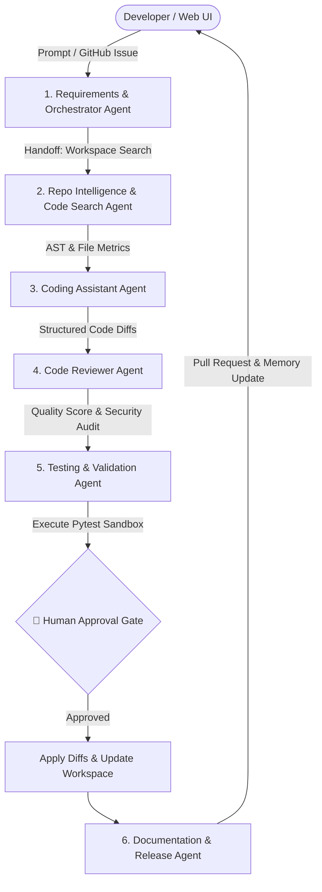

# 🚀 AI Software Engineering Assistant
> **Summer School '26 Capstone Project Final**  
> **Domain**: Software Development | **Framework**: OpenAI Agents SDK & Groq API

[](https://github.com/openai/openai-agents-python)
[](https://groq.com)
[](https://python.org)

An autonomous multi-agent software engineering assistant built with the **OpenAI Agents SDK** and powered by Groq's high-speed inference engine (`llama-3.3-70b-versatile`). The system ingests software engineering task prompts or GitHub issues, conducts workspace AST analysis, synthesizes code modifications, audits code for security & quality, generates unit tests, pauses at a **Human-in-the-Loop Approval Gate**, and opens Pull Requests.

---

## 📸 Executive Dashboard UI Screenshots

### 🌙 Dark Glassmorphic Theme


### ☀️ Light Executive Theme


### 🚀 Live Multi-Agent Pipeline Execution & Diff Viewer


---

## 🎥 Live Demo Video Walkthrough

- 🎬 **Demo Video File**: [`images and demo/demo_video.mp4`](images%20and%20demo/demo_video.mp4)
- 💡 **Highlights**: Real-time multi-agent handoff graph, automated code synthesis, unified git diff viewer, pytest sandbox execution, and human-in-the-loop authorization checkpoint.

---

## 🏗️ Multi-Agent System Architecture



---

## 🤖 6 Specialised AI Agents

| Agent Name | Role | Core Responsibility |
| :--- | :--- | :--- |
| **1. Requirements & Orchestrator Agent** | Coordinator | Analyzes prompt, decomposes task into structured execution plan using `TaskPlan` schema. |
| **2. Repo Intelligence Agent** | Codebase AST Search | Scans project directory, computes dependency graph, parses AST for functions and classes. |
| **3. Coding Assistant Agent** | Developer | Generates clean Python code diffs and file additions conforming to strict target specifications. |
| **4. Code Reviewer Agent** | Security & Quality Auditor | Audits diffs for security vulnerabilities, memory leaks, bugs, and assigns quality score (0–100). |
| **5. Testing & Validation Agent** | Test Engineer | Synthesizes pytest unit tests, executes test suite in subprocess sandbox, parses stack traces. |
| **6. Documentation & Release Agent** | Technical Writer & Release | Crafts comprehensive Pull Request descriptions, records release notes in memory store. |

---

## 🛠️ 6 Integrated Tools & APIs

1. **`CodeSearchTool`**: Performs workspace scans, text searches, and AST parsing for function/class definitions.
2. **`FileEditorTool`**: Reads files, generates color-coded unified git diffs, and applies patches safely to disk.
3. **`TestRunnerTool`**: Executes `pytest` unit test suites inside an isolated subprocess sandbox.
4. **`GitHubTool`**: Integrates with GitHub REST API to fetch issues and submit Pull Requests (with fallback mode).
5. **`WebSearchTool`**: Searches external developer documentation and Python library references via DuckDuckGo.
6. **`MemoryTool`**: Manages long-term codebase knowledge notes and session state persistence.

---

## 🔒 Security & Auth Manager Service

The platform includes an integrated **`AuthManager`** service (`services/auth_service.py`) providing:
- 🔑 **Token Generation & Validation**: Issues secure `nexus_sk_*` API session tokens (`/api/auth/token`, `/api/auth/validate`).
- 🛡️ **Sliding-Window Rate Limiting**: Prevents API abuse and enforces configurable call limits per client IP.
- 👤 **Credential Validation**: Validates user identities and role assignments (`developer`, `admin`).

---

## 🌟 Key Capstone Features

- ✅ **Agent Handoff Flow**: Explicit transition of context and state between specialised agents.
- ✅ **Human Approval Gate**: Interactive approval workflow where users can inspect side-by-side diffs before modifying files or creating PRs.
- ✅ **Structured Pydantic Outputs**: All inter-agent data exchanges enforce strict Pydantic schemas (`TaskPlan`, `CodeModification`, `ReviewResult`, `TestExecutionResult`).
- ✅ **Groq LLM Integration**: Uses Groq's fast OpenAI-compatible endpoint with `llama-3.3-70b-versatile`.
- ✅ **Security & Rate Limiting**: Built-in `AuthManager` with API token creation & sliding-window rate limit checks.
- ✅ **Executive Dark-Mode Web Dashboard**: Glassmorphic UI displaying real-time agent handoff node graph, diff viewer, log console, and memory inspector.

---

## ⚡ Quickstart Guide

### 1. Installation & Environment Setup
Clone the repository and install required Python packages:

```bash
git clone https://github.com/your-username/capstone-ai-software-assistant.html
cd capstone

# Install dependencies
pip install -r requirements.txt
```

### 2. Configure `.env` Key
Ensure your `.env` file contains your Groq API Key:

```env
GROQ_API_KEY=your_groq_api_key_here
MODEL_NAME=llama-3.3-70b-versatile
GROQ_BASE_URL=https://api.groq.com/openai/v1
HOST=127.0.0.1
PORT=8000
```

### 3. Run the Dashboard Application
Launch the FastAPI application:

```bash
python main.py
```

Open your browser and navigate to:  
👉 **`http://127.0.0.1:8000`**

---

## 📊 Verification & Testing

To run automated unit tests across all tools, agents, security auth, and FastAPI endpoints:

```bash
python -m pytest -v
```

---

## 📄 License
Created for **Summer School '26 Capstone Project Final**.
